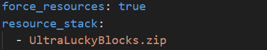

# **UltraLuckyBlocks 0.0.1**

This plugin adds **Lucky Blocks** to your server.
Currently, I use a pretty easy system, 
that drops a random amount of a random item.
This will surely be changed in the feature. 
I am going to rework the Lucky Block model as well.

### SETUP

You just need to implement the resource pack
from the resources folder  into your 
resource_packs folder. Then you'll need 
to add it in the **resource_packs.yml** as well.

**NOTE:** This Plugin fully depends on Customies. 
Customies is a very useful plugin, which makes it 
easier to register Blocks, Entities and Items
You can download Customies by following the link
- https://poggit.pmmp.io/ci/CustomiesDevs/Customies/~

### TOOLS

Tools I have used/am using for creating/updating this plugin. 

**NOTE:** It also uses various tools that poggit uses to create
and check  the plugin.
- https://www.jetbrains.com/de-de/phpstorm/download/
- https://www.blockbench.net

### SOCIALS

If you want to learn some basics of coding, 
you should have a look at my **YouTube** channel.
I currently try to upload 2 Videos a week.

- https://www.youtube.com/channel/UCgbsyomSNo3jutGEIlCPBhg

If you want me to create a plugin for you. 
Text me on Discord. (lukay1)

**NOTE:** I only take serious offers.